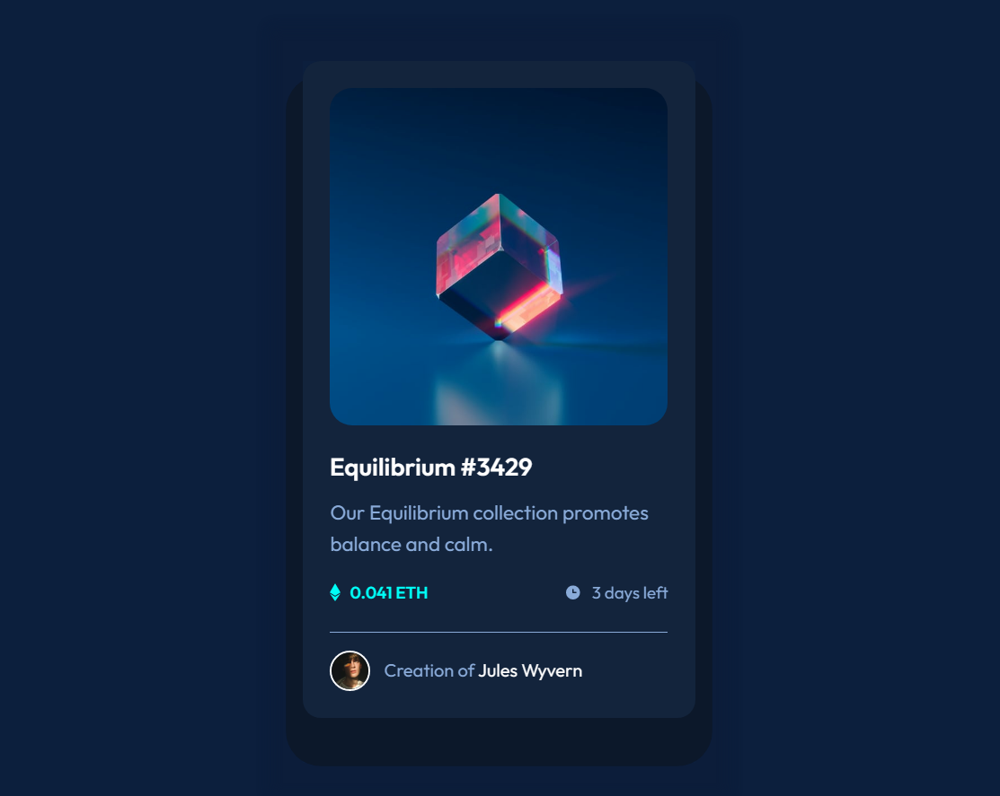
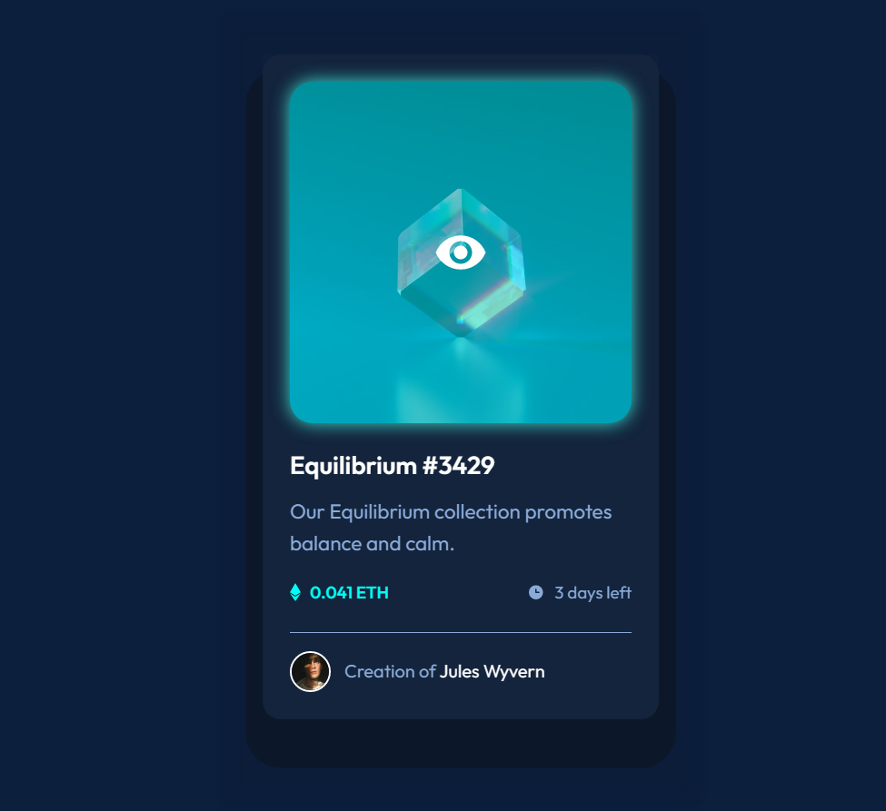

# Frontend Mentor - NFT preview card component solution

This is a solution to the [NFT preview card component challenge on Frontend Mentor](https://www.frontendmentor.io/challenges/nft-preview-card-component-SbdUL_w0U). Frontend Mentor challenges help you improve your coding skills by building realistic projects. 

## Table of contents

- [Overview](#overview)
  - [The challenge](#the-challenge)
  - [Screenshot](#screenshot)
  - [Links](#links)
- [My process](#my-process)
  - [Built with](#built-with)
  - [What I learned](#what-i-learned)
  - [Continued development](#continued-development)
  - [Useful resources](#useful-resources)
- [Author](#author)
- [Acknowledgments](#acknowledgments)

## Overview

### The challenge

Users should be able to:

- View the optimal layout depending on their device's screen size
- See hover states for interactive elements

### Screenshot

### Links

- Solution URL: [https://github.com/manjubhaskar02/FM-11-NFT-preview-card-component](https://github.com/manjubhaskar02/FM-11-NFT-preview-card-component)
- Live Site URL: [https://manjubhaskar02.github.io/FM-11-NFT-preview-card-component/](https://manjubhaskar02.github.io/FM-11-NFT-preview-card-component/)

## My process

### Built with

- Semantic HTML5 markup
- CSS custom properties
- Tailwind CSS

### What I learned

This design helps in learning how to use overlay effect over images. learned to provide a color overlay and an image overlay over an image using CSS 

### Continued development
Should continue exploring various overlay effects with CSS.
### Useful resources

- Tailwind CSS
- Animate.css 

## Author

- Frontend Mentor - [@manjubhaskar02](https://www.frontendmentor.io/profile/manjubhaskar02)

## Acknowledgments

I always want to thank my husband, Safaldas and my mentor, Sneha.